<p align="center">
  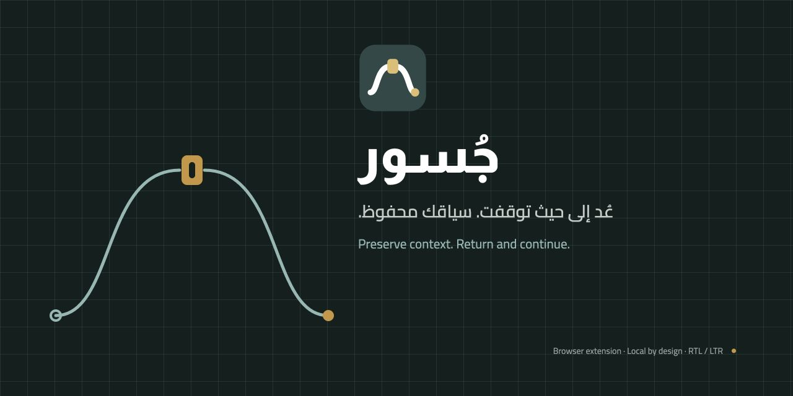
</p>

<h1 align="center">جُسور — Jusoor</h1>

<p align="center">
  <strong>إضافة متصفح تحفظ سياق عملك، لا تبويباتك وحدها.</strong><br>
  الصفحات التي اخترتها، وسبب فتح كل واحدة، وأين توقفت، وما الخطوة التالية —<br>
  تعود إليك كاملةً لحظة رجوعك.
</p>

<p align="center">
  <a href="#التثبيت"><strong>التثبيت</strong></a> ·
  <a href="#لماذا-جُسور">لماذا جُسور</a> ·
  <a href="#رحلة-استخدام-نموذجية">الرحلة</a> ·
  <a href="#لقطات-الشاشة">اللقطات</a> ·
  <a href="#الخصوصية">الخصوصية</a> ·
  <a href="#أسئلة-متكررة">الأسئلة</a> ·
  <a href="README.md">English</a>
</p>

<p align="center">
  
  
  
  
  
  
</p>

<p align="center">
  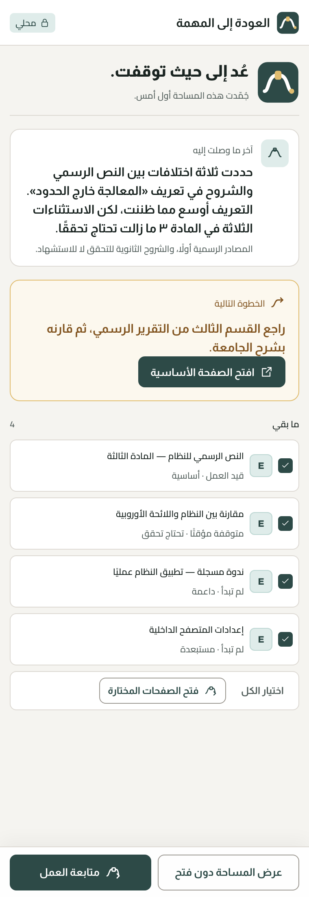
  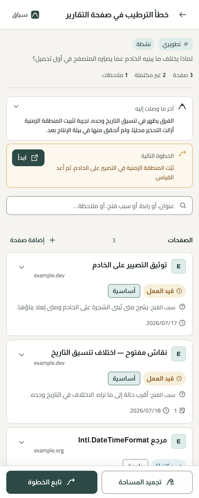
  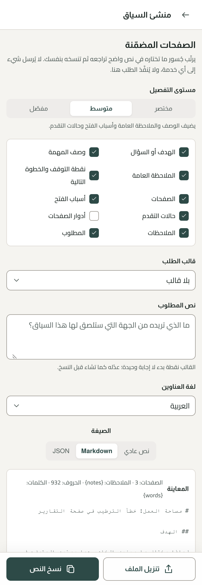
</p>

<p align="center"><em>شاشة العودة · داخل المساحة · منشئ السياق — لقطات حقيقية من الحزمة المبنية.</em></p>

---

## المتصفحات المدعومة

<table>
<tr>
<td valign="top" width="34%">

**متاح على**


مبني ومتحقَّق منه على الاثنين. Chromium و Manifest V3.

</td>
<td valign="top" width="34%">

**يُتوقع أن يعمل على**


متصفحات Chromium التي تدعم `chrome.sidePanel`. **لم تُختبر** — ولا نَدّعي ما لم نشغّله.

</td>
<td valign="top" width="32%">

**مخطط له**


مؤجل حتى تستقر النواة. Firefox يستخدم `sidebarAction`، وهو سطح مختلف — [قرار 0002](docs/decisions/0002-target-browsers.md).

</td>
</tr>
</table>

---

## لماذا جُسور؟

تفتح إحدى عشرة صفحة للإجابة عن سؤال واحد. تقرأ ستًّا منها، وتستبعد اثنتين، وتشك في واحدة، وتجرّب حلًّا ينجح نصف نجاح. ثم ينتهي اليوم.

بعد ثلاثة أيام تفتح الصفحات نفسها — فلا تتذكر أيٌّ منها شيئًا من ذلك. عادت الروابط، ولم يعد التفكير.

**ما ضاع فعلًا لم يكن في التبويبات أصلًا:**

- سبب فتح كل صفحة وعلاقتها بالمهمة
- ما قرأته، وما بقي ينتظر
- المصادر التي وثقت بها، والتي أبقيتها للإسناد، والتي استبعدتها
- ما جرّبته، ونتيجة كل محاولة
- النتيجة المؤقتة التي وصلت إليها
- السؤال الذي كنت تحاول الإجابة عنه فعلًا
- الشيء الوحيد الذي كنت تنوي فعله بعد ذلك

إعادة بناء هذا كله تكلّف وقتًا حقيقيًا، وكثيرًا ما تكرّر عملًا أنجزته من قبل.

### لماذا لا تسدّ الأدوات الحالية هذه الفجوة

لا عيب في أيٍّ منها. كل واحدة بُنيت لعمل مختلف.

| الأداة | ما صُممت لتتذكره | ما لا تحمله |
|---|---|---|
| **المفضلة** | عنوانًا يستحق البقاء طويلًا | لماذا حفظته، ولأي مهمة كان |
| **سجل التصفح** | أنك زرت شيئًا، مرتبًا زمنيًا | أي الزيارات كانت عملًا واحدًا، وأيها ضجيج |
| **مجموعات التبويبات** | ما هو مفتوح الآن في هذه النافذة | أي شيء بعد إغلاق النافذة |
| **قائمة القراءة** | أن مقالًا لم يُقرأ بعد | التقدم، والحكم، والملاحظات، والخطوة التالية |
| **مديرو الجلسات** | مجموعة التبويبات ليعيدوا فتحها | الاستدلال الذي جعل لتلك المجموعة معنى |

كلها تحفظ **العنوان**. والذي تفقده هو **السياق حوله**.

### ما الذي يفعله جُسور بدل ذلك

مساحة العمل تحمل مهمة واحدة — صفحاتها **واستدلالها** — منفصلةً عن بقية عملك.

كل صفحة تحمل سبب فتحها، وإلى أين وصلت فيها، ودورها، وملاحظاتك عليها. وتحمل المساحة أهم شيئين عند العودة: **أين توقفت**، و**الخطوة التالية**.

عند التوقف تجمّد المساحة، وتغلق تبويباتها إن أردت. وعند العودة يعرض جُسور موضعك السابق **قبل أن يفتح أي شيء**. تختار ما يُفتح، وتتابع من الخطوة التالية بدل إعادة بناء الصورة كلها في ذهنك.

> جُسور لا يعيدك إلى الصفحات؛ بل يعيدك إلى النقطة التي توقفت عندها في عملك وتفكيرك.

---

## لماذا اسم «جُسور»؟

**جُسور** جمع جسر.

الجسر لا يختصر المسافة؛ بل يجعل عبورها ممكنًا دون أن تفقد ما تحمله. وهذا هو المنتج كله: عبور بين جلسة انتهت وجلسة تبدأ — ويصل سياقك سليمًا إلى الضفة الأخرى.

والرمز ليس جسرًا واقعيًا. هو **مسار محفوظ**: بداية هادئة، وبوابة صغيرة يُحفظ عندها السياق، ونهاية عنبرية تمثل العودة والخطوة التالية.

---

## رحلة استخدام نموذجية

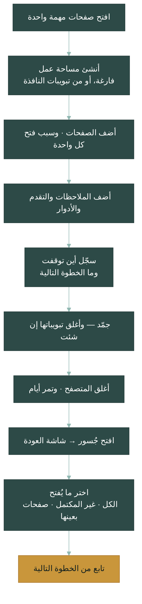

لا شيء في هذه السلسلة إلزامي عدا إنشاء المساحة. كل الحقول اختيارية، ويبقى للمنتج فائدة بالحد الأدنى — اسم وبضعة روابط.

---

## القدرات

### 🗂 مساحات العمل

**لماذا؟** — السياقات تتسرب. مهمتان في كومة واحدة لا تصيران واحدة، بل تفقدان الاثنتين.

**ماذا تفعل؟** — المساحة تحمل مهمة أو مشروعًا أو سؤالًا واحدًا: صفحاته وملاحظاته وتصنيفاته ونقطة توقفه وخطوته التالية. وتكون نشطة أو مجمدة أو مؤرشفة. تنشئها فارغة، أو من التبويبات المفتوحة في نافذتك — تختار أيها، ويُنبَّه على التكرار ولا يُدمج صامتًا.

**متى تستخدمها؟** — لحظة احتياج عمل ما إلى أكثر من صفحتين.

**مثال** — «نطاق تطبيق نظام PIPL» يحمل خمسة مصادر، وثلاث ملاحظات، وسؤالًا مفتوحًا واحدًا. وجلسة تصحيح الخطأ التي لا علاقة لها به مساحة مستقلة تبقى بعيدة عن الطريق.

---

### 📄 سياق الصفحة

**لماذا؟** — الرابط أقل ما يهم في صفحة حفظتها.

**ماذا تفعل؟** — كل صفحة تحمل **سبب الفتح**، و**حالة التقدم** (لم تبدأ · قيد العمل · متوقفة مؤقتًا · مكتملة)، و**الدور** (أساسية · داعمة · تحتاج تحققًا · مستبعدة)، ووسومًا اختيارية، وملاحظات. والتقدم والدور بُعدان منفصلان عمدًا — إلى أين وصلت ليس هو ما الصفحة **له**.

**متى تستخدمه؟** — كلما احتاجت صفحة إلى تبرير أمام نفسك بعد أيام.

**مثال** — مقال مقارنة بحالة **متوقف مؤقتًا / يحتاج تحققًا**، وملاحظة: «ثلاثة ادعاءات هنا لم أجد لها أصلًا في النص الرسمي». بعد ثلاثة أيام تعرف تمامًا لماذا لم تستشهد به.

---

### 📍 نقطة التوقف والخطوة التالية

**لماذا؟** — العودة مكلفة لأن السؤال الأول دائمًا: «أين كنت؟»

**ماذا تفعل؟** — حقلان، هما أوضح عنصرين في المنتج كله عن قصد. **آخر ما وصلت إليه** يصف الحالة الفعلية لحظة التوقف: نتيجة مؤقتة، أو تعارض لم يُحسم، أو ما بقي. و**الخطوة التالية** إجراء واحد محدد تبدأ به.

**متى تستخدمهما؟** — قبل أن تتوقف مباشرة. اختياريان، لكنهما أعلى ما يمكن أن تكتبه قيمةً.

**مثال** — «حددت ثلاثة اختلافات بين النص الرسمي والشروح. التعريف أوسع مما ظننت، لكن الاستثناءات الثلاثة في المادة ٣ ما زالت تحتاج تحققًا.» ← التالي: «راجع القسم الثالث من التقرير الرسمي».

---

### 🧊 التجميد والعودة

**لماذا؟** — إغلاق المتصفح يجب ألّا يكلّفك حالة تفكيرك.

**ماذا يفعل؟** — التجميد يحفظ المساحة وصفحاتها وترتيبها وملاحظاتها وتصنيفاتها. وتختار بين التجميد وحده والتجميد **مع** إغلاق تبويبات تلك المساحة — دائمًا خلف تأكيد صريح، ولا يقع تلقائيًا أبدًا. والعودة تفتح **شاشة العودة** أولًا، بترتيب ثابت: أين توقفت ← الخطوة التالية ← ما بقي ← ملخص الاستعادة.

**متى تستخدمه؟** — في نهاية الجلسة، أو كلما انتقلت بين المهام.

**مثال** — جمّد مع إغلاق التبويبات، واخرج إلى إجازة نهاية الأسبوع، ثم تخبرك شاشة العودة يوم الاثنين بالحالة قبل أن يُفتح تبويب واحد.

---

### 🔓 الاستعادة الصادقة

**لماذا؟** — أداة تُبلّغ بنجاح لم يقع أسوأ من أداة لا تُبلّغ بشيء.

**ماذا تفعل؟** — تختار ما يُفتح: كل الصفحات، أو غير المكتملة وحدها، أو اختيارًا محددًا. ويُستعاد الترتيب والتبويب النشط قدر ما يسمح المتصفح. وكل صفحة تُبلّغ بما حدث فعلًا — فُتحت، أو غير متاحة، أو مخطط يرفض المتصفح فتحه. وحين يتعذر على جُسور شيء، يقوله ويعرض ما بقي محفوظًا.

**متى تستخدمها؟** — في كل عودة. وخصوصًا مع المساحات الكبيرة، حيث يسبق فتحَ عدد كبير من التبويبات تحذيرٌ.

**مثال** — تسع صفحات تُفتح، وواحدة صفحة `chrome://` داخلية يرفض المتصفح فتحها من إضافة. تظهر بوصفها غير متاحة، وعنوانها وملاحظاتها وسبب فتحها كما هي.

---

### 🔍 البحث والتنظيم

**لماذا؟** — مساحة فيها أربعون صفحة تحتاج تضييقًا، لا تمريرًا.

**ماذا يفعل؟** — بحث في العناوين والروابط وأسباب الفتح والملاحظات ونقاط التوقف والخطوات التالية — **بالعربية والإنجليزية**. والبحث العربي يطبّع التشكيل وفروق أ/إ/آ و ي/ى الشائعة، فلا تقرر طريقةُ كتابتك هل تجد ما تبحث عنه أم لا. وتُرتَّب الصفحات وتُصفّى بالترتيب الأصلي، أو تاريخ الإضافة، أو التقدم، أو الدور، أو وجود ملاحظات.

**متى تستخدمه؟** — حين تتجاوز المساحة نظرة واحدة.

**مثال** — كتابة `تحقق` تجد الصفحة التي وسمتها «يحتاج تحققًا» سواء كتبت الهمزة كما كتبتها أول مرة أو لم تكتبها.

---

### 📋 منشئ السياق

**لماذا؟** — عاجلًا أو آجلًا ستحتاج إلى تسليم هذا السياق إلى جهة أخرى: محادثة، أو مستند، أو زميل.

**ماذا يفعل؟** — يرتّب جُسور ما **تختاره أنت** في نص واضح مقروء — بثلاثة مستويات تفصيل، وخمسة قوالب بداية (بحث، مراجعة مشكلة تطويرية، تلخيص، مقارنة، استكمال عمل)، ومعاينة كاملة تحرّرها قبل النسخ. والاختصار يتحقق بتضمين **أنواع بيانات أقل**، لا بإعادة كتابة كلامك.

**ولا يرسل شيئًا إلى أي جهة.** يجهّز النص، وتلصقه أنت حيث تشاء. ويسبق كل نسخٍ تنبيهُ خصوصية، لأن النص قد يحمل روابط خاصة أو ملاحظات داخلية أو رسائل خطأ.

**متى تستخدمه؟** — عند طلب المساعدة، أو كتابة تسليم، أو فتح تقرير.

**مثال** — اختر خمس صفحات، وضمّن الأسباب والملاحظات، واستبعد الملاحظة العامة، وعايِن، وعدّل سطر الافتتاح، وانسخ، والصق في أي أداة تختارها.

---

### 📦 التصدير والاستيراد والنسخ الاحتياطي

**لماذا؟** — التخزين المحلي يعني أنك تملك النسخة الوحيدة. وهذه ميزة ومسؤولية معًا.

**ماذا يفعل؟** — **JSON** هو عقد النقل بمخطط معلَن: تصدير مساحة واحدة أو كلها، وإعادة استيراد بتحقق صارم. أما **النص العادي** و**Markdown** فمخرجات قراءة ومشاركة — ناقصة عمدًا لأنها تحترم خيارات التضمين، فليست نسخًا احتياطية. وعند التعارض يعرض الاستيراد أربعة خيارات صريحة — إنشاء نسخة، أو الاستبدال، أو دمج الصفحات غير المكررة، أو الإلغاء — ولا يكتب شيئًا قبل اكتمال التحقق.

**متى تستخدمه؟** — قبل أن يصير عملك مهمًا. ثم بانتظام.

**مثال** — صدّر كل شيء إلى JSON شهريًا. وصدّر مساحة واحدة إلى Markdown لتلصقها في تطبيق ملاحظاتك.

---

### 🌐 العربية والإنجليزية، فاتح وداكن

**لماذا؟** — العمل ثنائي اللغة يستحق واجهة واحدة متكيفة، لا منتجين نصفَين.

**ماذا يفعل؟** — العربية (RTL) والإنجليزية (LTR) في واجهة واحدة مبنية على الخصائص المنطقية، منذ النسخة الأولى. ووضعان فاتح وداكن. واللغة تتبع المتصفح افتراضيًا ويمكن تغييرها في أي وقت.

وتغيير لغة الواجهة **لا يترجم محتواك**. ولغة العناوين في السياق المنسوخ مستقلة عن لغة الواجهة.

**متى تستخدمه؟** — دائمًا. ليس إعدادًا تبحث عنه.

**مثال** — واجهة عربية، ومصدر إنجليزي، وملاحظة تخلط الاثنين. تبقى الروابط والأكواد وأسماء الملفات LTR داخل النص العربي، حيث ينبغي لها.

---

## لماذا يختلف جُسور؟

ليس أفضل — بل **مختلف**. كل أداة مما يلي تؤدي عملها جيدًا.

| | صُممت للإجابة عن | يجيب جُسور عن |
|---|---|---|
| **المفضلة** | «أين أجد هذا مرة أخرى؟» | «لماذا احتفظت به، ولأي مهمة؟» |
| **السجل** | «ماذا زرت؟» | «أي الزيارات كانت عملًا واحدًا؟» |
| **مجموعات التبويبات** | «ما المفتوح الآن؟» | «ماذا كنت أفعل، وإلى أي نتيجة وصلت؟» |
| **مديرو الجلسات** | «هل أستعيد هذه التبويبات؟» | «هل أستعيد استدلالي؟» |
| **تطبيقات الملاحظات** | «أين أكتب؟» | «كيف ترتبط هذه الملاحظة بتلك الصفحة وبهذه المهمة؟» |
| **برامج إدارة المراجع** | «كيف أستشهد بهذا بشكل صحيح؟» | «ما الذي قررته عن هذا المصدر، ولماذا؟» |

جُسور ليس بديلًا عن أيٍّ منها. هو يقع في الفجوة التي تتركها كلها: **العلاقة بين الصفحة، وسبب وجودها في عملك، وأين توقفت.**

فإن كنت تستخدم Zotero للاستشهاد وObsidian للملاحظات، فجُسور لا يستبدل واحدًا منهما؛ بل يتذكر الجزء الذي يقع **في المتصفح** — الجزء الساكن اليوم في عشرين تبويبًا تخشى إغلاقها.

---

## ما ليس جُسور

- **ليس مدير تبويبات.** لا يحاول امتلاك تبويباتك ولا عدّها ولا تعليقها ولا تقليل ذاكرتها. وإغلاق التبويبات عند التجميد اختياري وبتأكيد دائمًا.
- **ليس إضافة ذكاء اصطناعي.** لا نموذج فيه، ولا مفتاح API، ولا تلخيص، ولا ترجمة، ولا حكم على مصادرك. منشئ السياق يرتّب نصك **أنت** ويعيده إليك. لا أكثر.
- **ليس خدمة سحابية.** لا خادم أصلًا. لا خاصًّا ولا مشتركًا.
- **ليس تطبيق ملاحظات.** الملاحظة ترتبط بصفحة أو بمساحة. ليس مكانًا ليومياتك.
- **ليس خدمة مزامنة.** لا حساب، ولا تسجيل دخول، ولا مزامنة بين الأجهزة.
- **ليس برنامج إدارة مراجع.** يسجّل **حكمك** على المصدر، ولا ينسّق الاستشهادات.

**وما هو فعلًا:** إضافة متصفح محلية تحفظ سياق مهمة واحدة وتعيدك إليه — الصفحات، والأسباب، والملاحظات، وأين توقفت، وما التالي.

---

## الخصوصية

**«محلي أولًا» ليست عبارة تسويقية هنا. المتصفح نفسه هو الذي يفرضها.**

- **لا حسابات** — لا شيء تسجّل دخوله، ولا شيء تشترك فيه.
- **لا سحابة** — لا يوجد خادم يستقبل بياناتك.
- **لا تتبّع ولا تحليلات** — لا بيانات استخدام من أي نوع، ولا ملفات تعريف ارتباط.
- **لا ذكاء اصطناعي مدمج** — لا نموذج، ولا مفتاح API، ولا حكم آلي على مصادرك.
- **لا يُقرأ محتوى صفحاتك أبدًا** — لا content scripts، ولا صلاحية `scripting`، ولا صلاحيات مواقع.
- **بياناتك تبقى على جهازك** — المساحات والصفحات في IndexedDB محلية، والإعدادات في `chrome.storage.local`.

### كيف يُفرَض «لا شبكة» فعليًا

تُشحن الإضافة بسياسة أمن المحتوى الآتية:

```
script-src 'self'; object-src 'self'; connect-src 'none'
```

`script-src` يمنع الكود البعيد، لكنه **لا يمنع** الاتصال الصادر وحده. `connect-src 'none'` هو ما يمنعه: يوقف `fetch` و`XMLHttpRequest` و`WebSocket` و`EventSource` و`sendBeacon` وقت التشغيل، لكل ما يعمل داخل صفحات الإضافة — شيفرتنا وأي تبعية على السواء.

فالضمان ليس «راجعنا الشيفرة فلم نجد استدعاء شبكة»، بل **رفض المتصفح أن يقع اتصال أصلًا.** ويسنده حارسان آليان: واحد يرفض أي واجهة شبكة في المصدر، وآخر يفحص **المخرجات المبنية**، وثالث يتحقق من وجود `connect-src 'none'` في الـmanifest المشحون لهدفَي Chrome وEdge معًا.

### المقايضة الصادقة

لأن التخزين محلي بالكامل، فإن **حذف بيانات المتصفح أو إزالة الإضافة يحذف مساحاتك.** ولا جهة أخرى تملك نسخة يمكن استعادتها. التصدير والنسخ الاحتياطي على الشاشة الرئيسية، وشاشة أول تشغيل تقول هذا قبل أن تبني عليه عملك.

السياسة الكاملة بالعربية والإنجليزية: [docs/privacy-policy.md](docs/privacy-policy.md)

---

## لقطات الشاشة

لقطات حقيقية من الحزمة المبنية بعرض اللوحة المرجعي (380px)، لا نماذج تصميمية. والنسخ الإنجليزية لكل شاشة في [الصفحة الإنجليزية](README.md#screenshots).

<table>
<tr>
<td width="33%">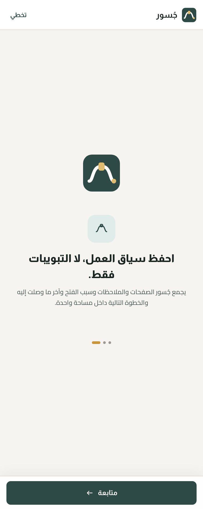</td>
<td width="33%">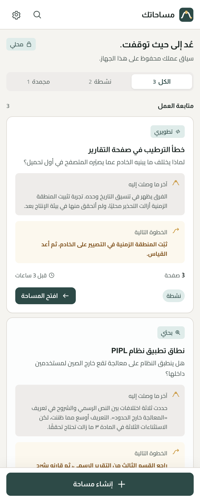</td>
<td width="33%"></td>
</tr>
<tr>
<td valign="top">

**أول تشغيل**

ما الذي يُحفظ وأين — يُقال **قبل** أن تبني عليه عملك، لا بعده.

</td>
<td valign="top">

**مساحاتك**

كل بطاقة تبدأ بما يحتاج استكمالًا: الخطوة التالية، وعدد الصفحات، والحالة، وآخر عمل عليها. مرتَّبة بالأحدث **عملًا** لا بالأحدث إنشاءً.

</td>
<td valign="top">

**داخل المساحة**

نقطة التوقف والخطوة التالية أولًا، عن قصد، فوق الصفحات وفوق بيانات المساحة نفسها.

</td>
</tr>
<tr>
<td>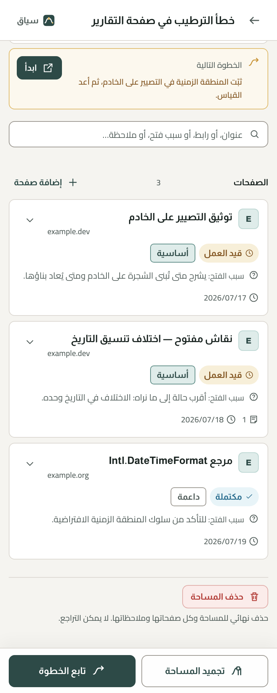</td>
<td>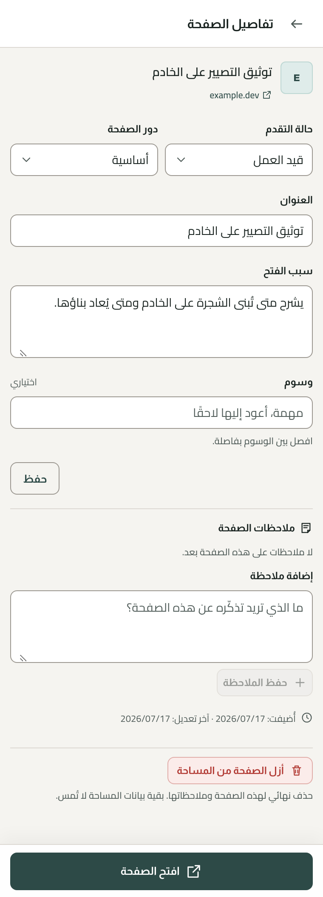</td>
<td>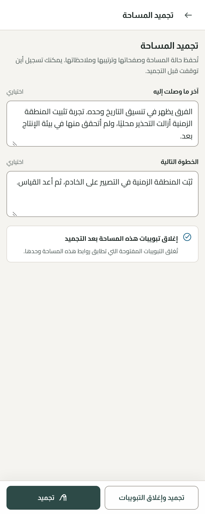</td>
</tr>
<tr>
<td valign="top">

**الصفحات والبحث والتصفية**

كل صفحة تعرض تقدمها ودورها وعدد ملاحظاتها. والبحث يشمل العناوين والروابط والأسباب والوسوم ونص الملاحظات. والعدّ يذكر دائمًا ما تراه من الكل.

</td>
<td valign="top">

**تفاصيل الصفحة**

سبب الفتح، والتقدم، والدور، والوسوم، والملاحظات. والتقدم والدور عنصران منفصلان — لا يُدمجان في قائمة واحدة.

</td>
<td valign="top">

**التجميد**

طلب خفيف لتسجيل أين توقفت — غير إلزامي أبدًا. وإغلاق التبويبات اختيار مستقل وصريح.

</td>
</tr>
<tr>
<td></td>
<td></td>
<td>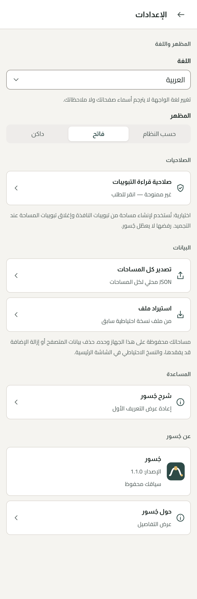</td>
</tr>
<tr>
<td valign="top">

**شاشة العودة**

أهم لحظة في المنتج. بترتيب ثابت: أين توقفت، ثم الخطوة التالية، ثم ما بقي، ثم ملخص الاستعادة — كل ذلك قبل أن يُفتح تبويب واحد.

</td>
<td valign="top">

**منشئ السياق**

مستوى التفصيل، وقالب الطلب، وأنواع البيانات المضمَّنة بالضبط. والمعاينة تسبق النسخ دائمًا.

</td>
<td valign="top">

**الإعدادات**

اللغة والمظهر، ولا شيء غيرهما. واللغة تتبع المتصفح افتراضيًا ولا تمسّ محتواك.

</td>
</tr>
</table>

### واجهة واحدة، اتجاهان وسمتان

<table>
<tr>
<td width="25%"></td>
<td width="25%">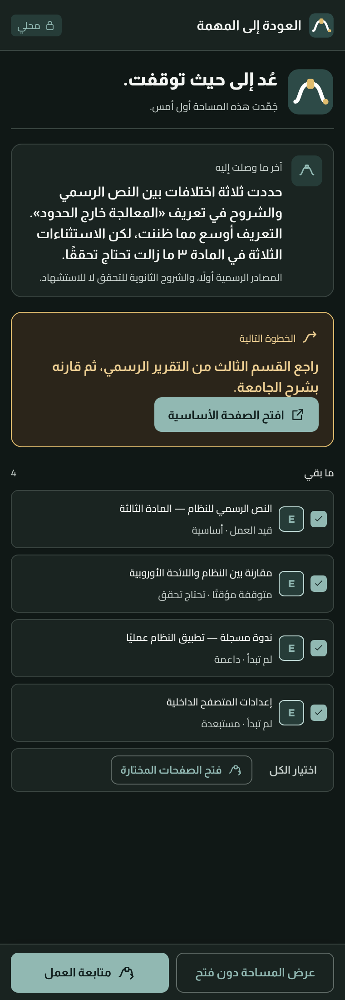</td>
<td width="25%">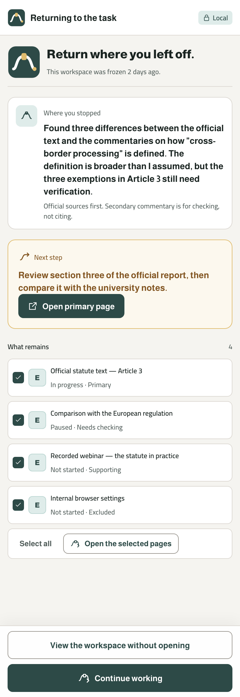</td>
<td width="25%">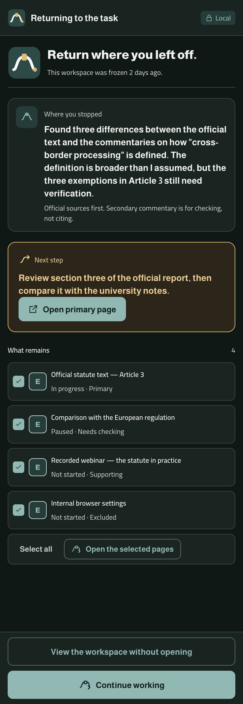</td>
</tr>
<tr>
<td align="center"><sub>عربي · فاتح</sub></td>
<td align="center"><sub>عربي · داكن</sub></td>
<td align="center"><sub>إنجليزي · فاتح</sub></td>
<td align="center"><sub>إنجليزي · داكن</sub></td>
</tr>
</table>

الشاشة نفسها والمكونات نفسها. الاتجاه يأتي من خصائص CSS المنطقية لا من ورقة أنماط معكوسة، والوضع الداكن يرفع إضاءة الأسطح بدل قلب الألوان.

---

## الصلاحيات

يُثبَّت جُسور **بلا أي تحذير صلاحيات**. والصلاحية الوحيدة التي قد تُظهر تحذيرًا اختيارية، ورفضها لا يعطّل المنتج.

| الصلاحية | النوع | لماذا | إن رفضتها |
|---|---|---|---|
| `storage` | أساسية | حفظ تفضيلات اللغة والمظهر على جهازك | — |
| `sidePanel` | أساسية | اللوحة الجانبية **هي** الواجهة | — |
| `activeTab` | أساسية | قراءة **عنوان ورابط** التبويب الحالي بعد نقرك «قراءة الصفحة المفتوحة». ولا يُقرأ محتوى الصفحة | — |
| `tabs` | **اختيارية** | تُطلب بنقرة صريحة وحدها: سرد تبويبات النافذة لتختار منها، وتمييز تبويبات المساحة لإغلاقها عند التجميد | الإنشاء اليدوي، والتجميد بلا إغلاق، وإضافة الصفحات بالرابط — كلها تعمل كاملةً |

### ما لا يُطلب عمدًا

`scripting` · `host_permissions` · `<all_urls>` · `unlimitedStorage` · `downloads` · `history` · `bookmarks` · `cookies` · `webNavigation` · `identity` · `tabGroups` · `declarativeNetRequest`

بلا `scripting` وبلا صلاحيات مواقع، **لا تستطيع الإضافة قراءة محتوى الصفحات التي تزورها** — وهذه حقيقة بنيوية في الـmanifest، لا وعد عن سلوك. ويتحقق حارس آلي من مجموعة الصلاحيات حرفيًا في الـmanifest المبني، ويُفشِل البناء عند أي إضافة.

التفصيل الكامل: [قرار 0004](docs/decisions/0004-permissions.md) · [قرار 0012](docs/decisions/0012-current-page-capture.md)

---

## المعمارية

```
entrypoints → ui → app → core
                    ├→ storage
                    └→ browser
```

| الطبقة | المسؤولية |
|---|---|
| `core/` | منطق المنتج. TypeScript خالص بلا آثار جانبية ولا نصوص واجهة ولا `Date.now()` |
| `browser/` | **الموضع الوحيد الذي يجوز فيه ظهور `chrome.*`** |
| `storage/` | IndexedDB و`chrome.storage.local` |
| `app/` | تنسيق حالات الاستخدام — طبقة رفيعة لا معمارية ثقيلة |
| `ui/` | العرض (React) |
| `i18n/` | نصوص الواجهة |

**الاتجاه مفروض بالاختبارات لا بالاتفاق.** `tests/guards/` تُفشِل البناء عند: ظهور `chrome.*` خارج `src/browser/`، أو استيراد `ui/` من `storage/` أو `browser/`، أو أي واجهة شبكة في المصدر **أو في المخرجات المبنية**، أو أي مورد خارجي، أو أي تغيير في مجموعة الصلاحيات، أو أي مساس بحزمة الهوية، أو ألوان حرفية وخصائص اتجاهية مادية في CSS المكونات، أو شحن الخطوط بلا تراخيصها.

وحصر `chrome.*` في طبقة واحدة هو أيضًا ما يجعل دعم Firefox لاحقًا استبدالًا لمجلد واحد لا إعادة كتابة.

كل قرار معماري موثق في [`docs/decisions/`](docs/decisions/) — ستة عشر قرارًا من اختيار التقنية إلى نموذج البيانات إلى عقد النقل. والمراجعة المعمارية وخريطة الطريق في [`docs/reviews/`](docs/reviews/).

---

## أسئلة متكررة

<details>
<summary><strong>هل جُسور متاح في متجر Chrome؟</strong></summary><br>

ليس بعد. النسخة 1.1.0 **مرشح إصدار**: مكتملة ومتحقَّق منها، لكنها لم تُرفع إلى أي من المتجرين. وحتى ذلك الحين ثبّتها من المصدر — انظر [التثبيت](#التثبيت). وما بقي قبل النشر مذكور في [docs/store-listing.md](docs/store-listing.md).
</details>

<details>
<summary><strong>أين بياناتي بالضبط؟</strong></summary><br>

على جهازك، داخل ملف تعريف متصفحك. المساحات والصفحات والملاحظات والتصنيفات في قاعدة **IndexedDB** محلية اسمها `jusoor`. واللغة والمظهر وعلامة أول تشغيل ومؤشر آخر مساحة في `chrome.storage.local`. ولا مكان آخر — لا يوجد خادم يُرسَل إليه شيء.
</details>

<details>
<summary><strong>ماذا يحدث إن حذفت بيانات المتصفح؟</strong></summary><br>

تفقد مساحاتك. هذه الكلفة المباشرة لعدم وجود خادم، ويقولها جُسور في أول تشغيل لا بعد وقوعها. صدّر نسخة JSON احتياطية من الشاشة الرئيسية متى صار عملك مهمًا — فهي نسخة كاملة قابلة لإعادة الاستيراد.
</details>

<details>
<summary><strong>هل يستطيع جُسور قراءة الصفحات التي أزورها؟</strong></summary><br>

لا، وليس بالسياسة بل بالبنية. لا يشحن content scripts ولا يطلب `scripting` ولا أي صلاحية موقع، فلا يمنحه المتصفح آليةً لقراءة المحتوى أصلًا. ويستطيع قراءة **عنوان التبويب ورابطه** فقط، وبعد أن تطلب ذلك صراحةً.
</details>

<details>
<summary><strong>هل يستخدم ذكاءً اصطناعيًا؟</strong></summary><br>

لا. لا نموذج، ولا مفتاح API، ولا اتصال صادر يصل إليه أصلًا. ومنشئ السياق يجمّع النص الذي **اخترته أنت** لتراجعه وتنسخه بنفسك — وأين تلصقه قرارك وحدك. و«المختصر» و«المفصل» يغيّران أنواع البيانات المضمَّنة، ولا يعيدان كتابة كلامك أبدًا.
</details>

<details>
<summary><strong>لماذا <code>tabs</code> اختيارية لا أساسية؟</strong></summary><br>

لأن رفضها لا يعطّل المنتج. إنشاء المساحات يدويًا، وإضافة الصفحات بالرابط، والتجميد بلا إغلاق تبويبات — كلها تعمل كاملةً بدونها. والصلاحية التي هي اختيارية فعلًا يجب أن تُطلب لحظة الحاجة إليها بنقرة صريحة، لا عند التثبيت.
</details>

<details>
<summary><strong>هل يستعيد موضع القراءة داخل الصفحة؟</strong></summary><br>

لا — ولا يدّعي ذلك. التقاط موضع القراءة يحتاج content script، وهو ما لا تشحنه النسخة الأولى عمدًا. وبدل استعادة موضع تقريبيًا وتسميته نجاحًا، يستعيد جُسور الصفحة ويبلّغ بصدق بما فعله. واستعادة موضع القراءة قدرة مستقبلية موثقة.
</details>

<details>
<summary><strong>هل يترجم تغييرُ لغة الواجهة ملاحظاتي؟</strong></summary><br>

أبدًا. نصوص الواجهة وحدها تتبدل؛ ومحتواك يبقى بلغته التي كتبته بها. حتى لغة العناوين في السياق المنسوخ اختيار منفصل عن لغة الواجهة.
</details>

<details>
<summary><strong>كم مساحةً أو صفحةً يتحمل؟</strong></summary><br>

لا حد ثابت مفروض. البيانات نص محض — لا محتوى صفحات ولا مرفقات ثنائية — فتبقى دون السقف الافتراضي للمتصفح بمسافة مريحة. و`unlimitedStorage` غير مطلوبة عمدًا؛ ويُعاد النظر في ذلك بأدلة قياس لا احترازًا.
</details>

<details>
<summary><strong>هل يعمل دون اتصال؟</strong></summary><br>

نعم، كاملًا. المساحات والملاحظات ونقاط التوقف ومنشئ السياق تعمل كلها بلا اتصال. ولا يحتاج الاتصال إلا فتحُ المصادر البعيدة نفسها — أما سياقك المحلي فلا يتوقف عليه.
</details>

---

## خريطة الطريق

هنا الخطط المعتمدة وحدها. وما ليس في هذه القائمة ليس التزامًا.

**V1 — مرشح إصدار، مكتمل**
القدرات الإحدى عشرة التي يوجبها دستور المنتج: المساحات، وسياق الصفحة، ونقطة التوقف والخطوة التالية، والتجميد والاستعادة، والبحث بالعربية والإنجليزية، ومنشئ السياق بمعاينته، والتصدير والاستيراد، والتخزين المحلي بلا حساب، وواجهة عربية وإنجليزية بـRTL و LTR.

**V1.1 — مؤجَّل بالنطاق لا بالصعوبة**

- الحذف وسلة المحذوفات مع التراجع — يحتاج سياسة حذف موثقة أولًا
- نقل الصفحات ونسخها بين المساحات
- الإجراءات السريعة في القائمة الصغيرة
- إدارة المؤرشف، والأقسام الاختيارية داخل المساحة

**V2 — مؤجَّل بنص الدستور**

- التظليل: حفظ النص المحدد مع صفحته وملاحظته وموضعه التقريبي
- استعادة موضع القراءة
- سجل موجز للأحداث — الإنشاء والإضافة والتعديل والتجميد والاستعادة — لتذكيرك بتطور العمل لا لمراقبتك
- دعم Firefox ([قرار 0002](docs/decisions/0002-target-browsers.md))

**غير مخطط له في أي نسخة:** الحسابات، أو المزامنة السحابية، أو المشاركة الحية، أو ذكاء اصطناعي مدمج، أو حكم آلي على المصادر، أو قراءة محتوى الصفحات دون اختيارك الصريح. واعتماد أيٍّ منها يتطلب قرار منتج صريحًا، ويجب ألا يغيّر ملكية المستخدم للمعنى، أو مبدأ التخزين المحلي، أو استقلال جُسور عن خدمات الذكاء الاصطناعي.

التفصيل الكامل: [docs/reviews/V1-Architecture-Review-and-Roadmap.md](docs/reviews/V1-Architecture-Review-and-Roadmap.md)

---

## التثبيت

جُسور لم يُنشر بعد في متجر Chrome ولا في Microsoft Edge Add-ons. وحتى ذلك الحين حمّله غير مضغوط — والحزمة أدناه هي نفسها التي ستُرفع.

### ابنِ الحزمة

```bash
git clone <repository-url> jusoor
cd jusoor
pnpm install
pnpm build          # → .output/chrome-mv3
pnpm build:edge     # → .output/edge-mv3
```

يتطلب **Node.js 20+** و**pnpm 11**.

### حمّله في Chrome

1. افتح `chrome://extensions`
2. فعّل **وضع المطوّر** (أعلى اليمين)
3. اضغط **تحميل غير مضغوط** (Load unpacked)
4. اختر مجلد `.output/chrome-mv3`
5. ثبّت جُسور في الشريط، واضغطه، ثم اضغط **فتح جُسور** لفتح اللوحة الجانبية

### حمّله في Edge

1. افتح `edge://extensions`
2. فعّل **وضع المطوّر** (الشريط الجانبي)
3. اضغط **تحميل غير مضغوط**
4. اختر مجلد `.output/edge-mv3`
5. ثبّت جُسور في الشريط، واضغطه، ثم اضغط **فتح جُسور** لفتح اللوحة الجانبية

> **ملاحظة:** الإضافة غير المضغوطة تُزال بإزالة مجلدها، وقد يعرض Chrome تنبيه وضع المطوّر عند كل تشغيل. ولا يمسّ ذلك بياناتك، فهي في ملف تعريف المتصفح.

---

## للمطورين

### المتطلبات

- Node.js 20+
- pnpm 11

### الأوامر

```bash
pnpm install          # تثبيت التبعيات
pnpm dev              # تشغيل التطوير (Chrome)
pnpm dev:edge         # تشغيل التطوير (Edge)
pnpm build            # بناء chrome-mv3
pnpm build:edge       # بناء edge-mv3
pnpm zip              # حزمة قابلة للرفع
pnpm typecheck        # tsc --noEmit
pnpm lint             # eslint
pnpm test             # vitest
pnpm check            # typecheck ← lint ← test ← build
pnpm verify:identity  # فحص سلامة حزمة الهوية وحدها
```

> **ملاحظة على `pnpm dev`:** سياسة `connect-src 'none'` تمنع اتصال HMR، فيلزم إعادة تحميل الإضافة يدويًا بعد كل تعديل. وهذا مقصود: صحة المنتج المشحون تسبق راحة التطوير.

### بنية المشروع

```
src/
├── core/         منطق المنتج — خالص بلا آثار جانبية
├── browser/      الموضع الوحيد لـ chrome.*
├── storage/      IndexedDB و chrome.storage.local
├── app/          تنسيق حالات الاستخدام
├── ui/           مكونات React والشاشات
├── i18n/         نصوص الواجهة (ar / en)
└── entrypoints/  background · popup · sidepanel

tests/
├── core/ storage/ app/ browser/ ui/ i18n/
└── guards/       حراس المعمارية والحدود

docs/
├── decisions/    16 قرارًا معماريًا
├── reviews/      المراجعة المعمارية وخريطة الطريق
└── screenshots/  لقطات من الحزمة المبنية

identity/         حزمة الهوية المعتمدة — للقراءة فقط
licenses/         تراخيص الخطوط (OFL 1.1)
```

### قبل تعديل أي شيء

وثيقتان تحكمان هذا المشروع وتتقدمان على أي اجتهاد فردي:

- [`Jusoor-Product-Constitution.md`](Jusoor-Product-Constitution.md) — ما هو المنتج، وما يرفض أن يصير إليه، ومعيار قبول أي إضافة
- [`Jusoor-Identity-Constitution.md`](Jusoor-Identity-Constitution.md) — النظام البصري، والـTokens، والمكونات، والوصول، والثوابت التي لا تتغير دون قرار جديد

ثم اقرأ القرار المعني في [`docs/decisions/`](docs/decisions/). ويجب أن يكون `pnpm check` أخضر قبل التعديل وبعده.

و`identity/` نسخة **مطابقة بايتًا ببايت** لمجموعة معتمدة من حزمة الهوية، يفرض ذلك حارس يقارنها بالحزمة نفسها. لا تُعدَّل أبدًا، ولا يُضاف إليها ملف من إنتاجنا. والقيم المشتقة من دستور الهوية تعيش في `src/ui/theme/`.

### المساهمة

لا توجد آلية مساهمة بعد، وIssues وDiscussions غير مفعّلتين — فالنسخة الأولى لا تعلن التزام دعم. وهذا توقف مقصود لا رفض؛ ويُعاد النظر فيه بعد النشر.

---

## التراخيص

**شيفرة جُسور وهويته البصرية: © 2026 سلطان — جميع الحقوق محفوظة.**
لم يُعتمد ترخيص عام بعد؛ واعتماده قرار مستقل قبل النشر. و`package.json` يعلن `UNLICENSED` حتى ذلك الحين.

**الخطوط:** **Almarai** و**Cairo** موزَّعان تحت [رخصة SIL Open Font License 1.1](licenses/fonts/). ونصوص الرخصة في [`licenses/fonts/`](licenses/fonts/) وتُشحن داخل الحزمة المبنية كما توجب OFL 1.1 عند إعادة التوزيع — ويتحقق من ذلك حارس آلي على مخرجات البناء لا على المستودع وحده.

---

## الحقوق

<p align="center">
  <sub>صُمّم وطُوّر بواسطة <strong>سلطان · Sultan</strong> — Design &amp; Development</sub><br>
  <sub><a href="CHANGELOG.md">سجل التغييرات</a> · <a href="docs/privacy-policy.md">سياسة الخصوصية</a> · <a href="docs/decisions/">القرارات</a> · <a href="README.md">English</a></sub>
</p>
