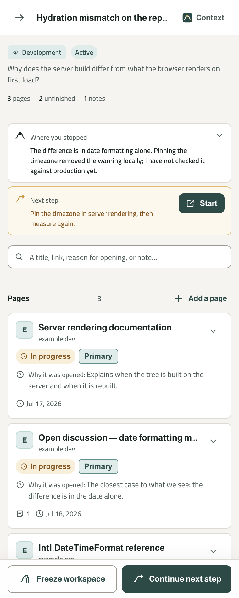
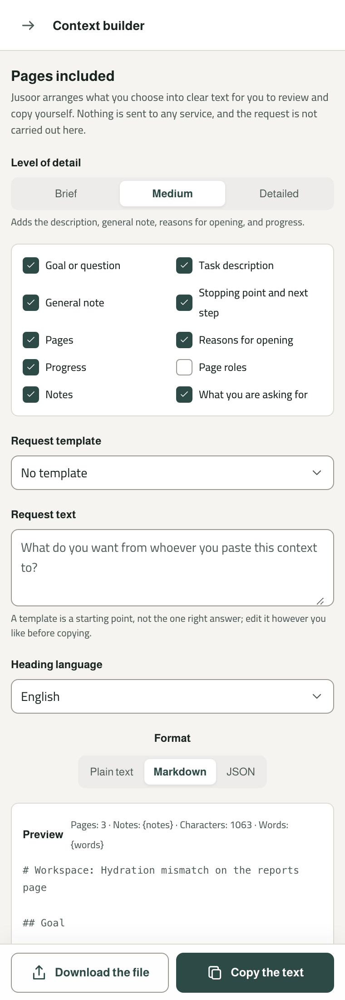
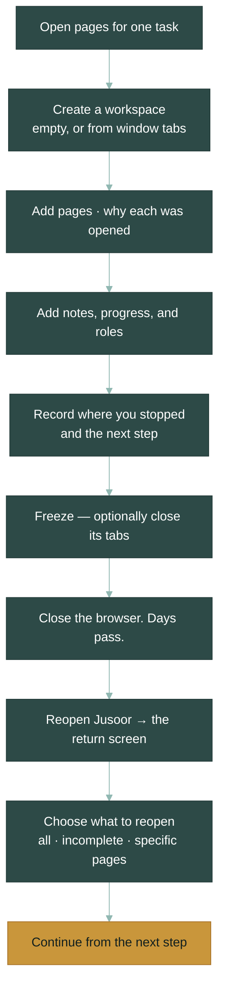
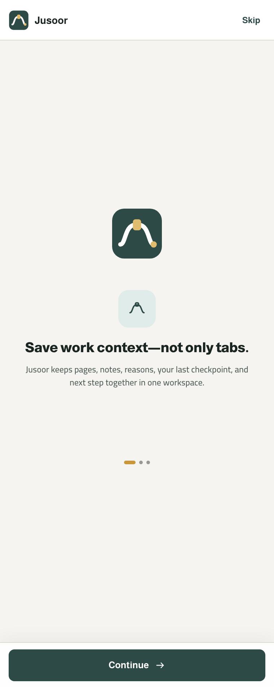
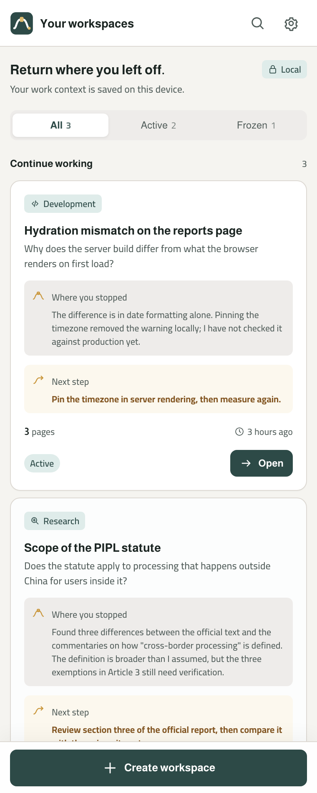
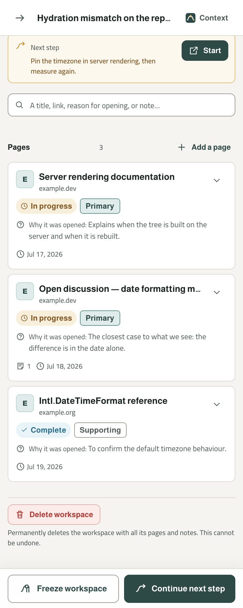
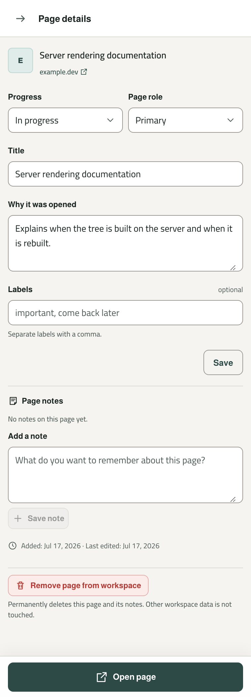
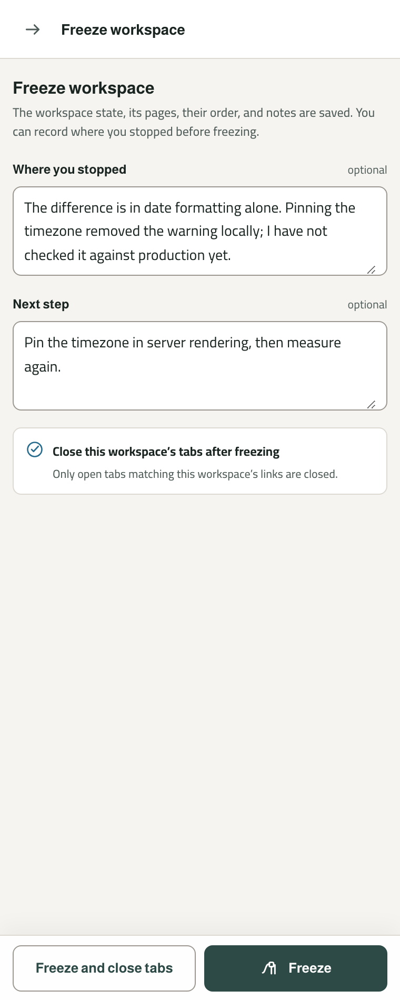
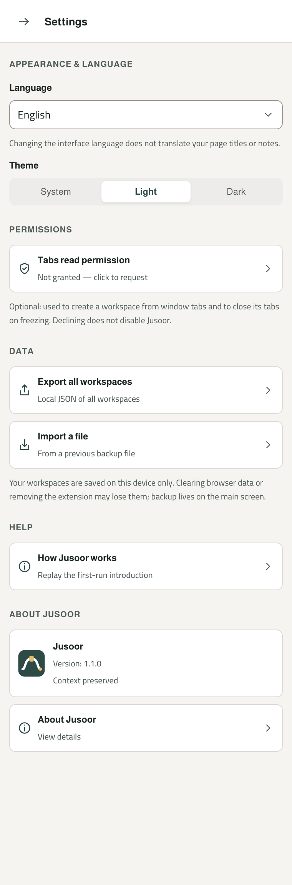

<p align="center">
  
</p>

<h1 align="center">جُسور — Jusoor</h1>

<p align="center">
  <strong>A browser extension that saves your working context, not just your tabs.</strong><br>
  The pages you chose, why you opened each one, where you stopped, and what comes next —<br>
  restored the moment you come back.
</p>

<p align="center">
  <a href="#installation"><strong>Install</strong></a> ·
  <a href="#why-jusoor">Why Jusoor</a> ·
  <a href="#typical-workflow">Workflow</a> ·
  <a href="#screenshots">Screenshots</a> ·
  <a href="#privacy">Privacy</a> ·
  <a href="#faq">FAQ</a> ·
  <a href="README.ar.md">العربية</a>
</p>

<p align="center">
  
  
  
  
  
  
</p>

<p align="center">
  
  
  
</p>

<p align="center"><em>The return screen · inside a workspace · the context builder — real captures of the built extension.</em></p>

---

## Supported browsers

<table>
<tr>
<td valign="top" width="34%">

**Available on**


Built and verified for both. Chromium, Manifest V3.

</td>
<td valign="top" width="34%">

**Should work on**


Chromium browsers with `chrome.sidePanel`. Not tested — we don't claim what we haven't run.

</td>
<td valign="top" width="32%">

**Planned**


Deferred until the core is stable. Firefox uses `sidebarAction`, a different surface — see [ADR 0002](docs/decisions/0002-target-browsers.md).

</td>
</tr>
</table>

---

## Why Jusoor?

You open eleven pages to answer one question. You read six of them, dismiss two, flag one as suspect, and try a fix that half works. Then the day ends.

Three days later you open those pages again — and none of them remember any of that. The links came back. The thinking didn't.

**What actually got lost was never in the tabs:**

- why each page was opened, and how it relates to the task
- what you had already read, and what was still waiting
- which sources you trusted, which you kept for support, and which you ruled out
- what you tried, and what the result of each attempt was
- the provisional conclusion you had reached
- the question you were actually trying to answer
- the one thing you meant to do next

Rebuilding that costs real time, and often repeats work you already finished.

### Why the existing tools don't close this gap

None of them are bad. They were each built for a different job.

| Tool | What it is designed to remember | What it does not carry |
|---|---|---|
| **Bookmarks** | An address, worth keeping indefinitely | Why you saved it, or which task it belonged to |
| **Browser history** | That you visited something, chronologically | Which visits were one piece of work, and which were noise |
| **Tab groups** | What is open right now, in this window | Anything after you close the window |
| **Reading list** | That an article is unread | Progress, judgement, notes, or what to do next |
| **Session managers** | The set of tabs, so it can reopen them | The reasoning that made the set meaningful |

Each stores **the address**. The part you lose is **the context around it**.

### What Jusoor does instead

A workspace holds one task — its pages *and* its reasoning — kept apart from your other work.

Each page carries why you opened it, how far you got, what role it plays, and your notes on it. The workspace carries the two things that matter most on return: **where you stopped**, and **the next step**.

When you stop, you freeze the workspace and optionally close its tabs. When you come back, Jusoor shows you where you were **before it opens anything**. You choose what to reopen, and continue from the next step instead of reconstructing the whole picture in your head.

> Jusoor doesn't return you to the pages. It returns you to the point where you stopped — in your work and in your thinking.

---

## Why the name "Jusoor"?

**جُسور** (*jusūr*) is Arabic for **bridges**.

A bridge doesn't shorten the distance. It makes crossing it possible without losing what you carry. That is the whole product: a crossing between the session that ended and the session that begins — and your context arrives intact on the other side.

The mark is not a literal bridge. It is a **saved path**: a quiet beginning, a small gate where context is stored, and an amber end that stands for the return and the next step.

---

## Typical workflow



Nothing in that chain is mandatory except creating a workspace. Every field is optional, and the product stays useful with the bare minimum — a name and a few links.

---

## Features

### 🗂 Workspaces

**Why** — Context bleeds. Two tasks in one pile become neither.

**What** — A workspace holds one task, project, or question: its pages, notes, classifications, stopping point, and next step. It can be active, frozen, or archived. Create one empty, or from the tabs already open in your window — you pick which tabs, and duplicates are flagged, never silently merged.

**When** — The moment a piece of work needs more than two pages.

**Example** — *"Scope of the PIPL statute"* holds five sources, three notes, and one open question. Your unrelated debugging session is a separate workspace and stays out of the way.

---

### 📄 Page context

**Why** — A link is the least interesting thing about a page you saved.

**What** — Every page carries a **reason for opening**, a **progress status** (not started · in progress · paused · complete), a **role** (primary · supporting · needs checking · excluded), optional labels, and notes. Progress and role are deliberately two separate dimensions — how far you got is not the same as what the page is *for*.

**When** — Whenever a page needs justifying to your future self.

**Example** — A comparison article marked **paused / needs checking**, with the note *"three claims here have no counterpart in the official text."* Three days later you know exactly why you didn't cite it.

---

### 📍 Stopping point & next step

**Why** — Returning is expensive because the first question is always *"where was I?"*

**What** — Two fields, deliberately the most prominent in the whole product. **Where you stopped** describes the real state at the moment you left: a provisional result, an unresolved conflict, what remains. **The next step** is one concrete action to start with.

**When** — Right before you stop. Optional, but it is the single highest-value thing you can type.

**Example** — *"Found three differences between the official text and the commentaries. The definition is broader than I assumed, but the three exemptions in Article 3 still need verification."* → next: *"Review section three of the official report."*

---

### 🧊 Freeze & return

**Why** — Closing the browser shouldn't cost you the state of your thinking.

**What** — Freezing saves the workspace, its pages, their order, notes, and classifications. You choose between freezing alone and freezing **with** closing that workspace's tabs — always behind an explicit confirmation, never automatic. Coming back opens the **return screen** first, in a fixed order: where you stopped → next step → what remains → restore summary.

**When** — At the end of a session, or whenever you switch tasks.

**Example** — Freeze with tab closing, quit for the weekend, and on Monday the return screen tells you the state before a single tab opens.

---

### 🔓 Honest restore

**Why** — A tool that reports success it didn't achieve is worse than one that reports nothing.

**What** — You choose what to reopen: everything, only the incomplete pages, or a specific selection. Order and the active tab are restored as far as the browser allows. Each page reports what actually happened — opened, unavailable, or a scheme the browser refuses. If Jusoor can't do something, it says so and shows you what is still saved.

**When** — Every return. Especially with large workspaces, where a warning precedes opening many tabs at once.

**Example** — Nine pages open, one is a `chrome://` internal page the browser refuses to open from an extension. It's listed as unavailable, with its title, notes, and reason for opening still intact.

---

### 🔍 Search & organization

**Why** — A workspace with forty pages needs narrowing, not scrolling.

**What** — Search across titles, links, reasons for opening, notes, stopping points, and next steps — **in Arabic and English**. Arabic search normalizes diacritics and the common أ/إ/آ and ي/ى variants, so how you typed it doesn't decide whether you find it. Pages sort and filter by original order, date added, progress, role, or whether they carry notes.

**When** — Once a workspace outgrows a single glance.

**Example** — Typing `تحقق` finds the page you labelled *يحتاج تحققًا* whether or not you typed the hamza the same way.

---

### 📋 Context builder

**Why** — Sooner or later you need to hand this context to something else: a chat, a document, a colleague.

**What** — Jusoor assembles what **you** select into clear, readable text — three levels of detail, five starting templates (research, debugging, summarize, compare, continue), and a full preview you can edit before copying. Shortening works by including fewer *kinds of data*, never by rewriting your words.

**It does not send anything anywhere.** It prepares text; you paste it where you choose. A privacy notice precedes every copy, because the text may carry private links, internal notes, or error messages.

**When** — Asking for help, writing a handover, or opening a report.

**Example** — Pick five pages, include reasons and notes, exclude the general note, preview, edit the opening line, copy, paste into whatever tool you like.

---

### 📦 Export, import & backup

**Why** — Local storage means *you* hold the only copy. That's a feature and a responsibility.

**What** — **JSON** is the transfer contract, with a declared schema: export one workspace or all of them, and re-import with strict validation. **Plain text** and **Markdown** are reading and sharing outputs — deliberately incomplete, since they honour your include options, so they are not backups. On conflict, import offers four explicit choices — create a copy, replace, merge the non-duplicate pages, or cancel — and writes nothing until validation fully passes.

**When** — Before anything matters. Then regularly.

**Example** — Export everything to JSON monthly. Export one workspace as Markdown to paste into your notes app.

---

### 🌐 Arabic & English, light & dark

**Why** — Bilingual work deserves one adaptive interface, not two half-products.

**What** — Arabic (RTL) and English (LTR) in a single interface built on logical properties, from the first version. Light and dark themes. Language follows the browser by default and can be changed at any time.

Changing the interface language **does not translate your content**. The language of headings in copied context is independent of the interface language.

**When** — Always. It is not a setting you have to find.

**Example** — Arabic interface, an English source, a note mixing both. Links, code, and file names stay LTR inside Arabic text, where they belong.

---

## Why is Jusoor different?

Not better — *different*. Each of these tools does its own job well.

| | Designed to answer | Jusoor answers |
|---|---|---|
| **Bookmarks** | "Where do I find this again?" | "Why did I keep it, and for which task?" |
| **History** | "What did I visit?" | "Which visits were one piece of work?" |
| **Tab groups** | "What's open right now?" | "What was I doing, and what did I conclude?" |
| **Session managers** | "Can I get these tabs back?" | "Can I get my reasoning back?" |
| **Note apps** | "Where do I write things down?" | "How does this note connect to that page and this task?" |
| **Reference managers** | "How do I cite this correctly?" | "What did I decide about this source, and why?" |

Jusoor is not an alternative to any of them. It sits in the gap they all leave: **the connection between a page, the reason it exists in your work, and where you stopped.**

If you already use Zotero for citations and Obsidian for notes, Jusoor doesn't replace either. It remembers the *browser* part of the work — the part that currently lives in twenty open tabs you're afraid to close.

---

## What Jusoor is NOT

- **Not a tab manager.** It doesn't try to own your tabs, count them, suspend them, or reduce their memory. Closing tabs on freeze is optional and always confirmed.
- **Not an AI extension.** There is no model in it, no API key, no summarizing, no translating, no judging your sources. The context builder arranges *your* text and hands it back to you. Nothing more.
- **Not a cloud service.** There is no server. Not a private one, not a shared one.
- **Not a notes app.** Notes attach to a page or a workspace. It is not a place to keep your journal.
- **Not a sync service.** No account, no sign-in, no cross-device sync.
- **Not a reference manager.** It records *your* judgement about a source. It doesn't format citations.

**What it is:** a local browser extension that preserves the context of one task and returns you to it — the pages, the reasons, the notes, where you stopped, and what comes next.

---

## Privacy

**Local first isn't a marketing line here. It's enforced by the browser.**

- **No accounts** — nothing to sign into, nothing to register.
- **No cloud** — there is no server to receive your data.
- **No tracking, no analytics** — no usage data of any kind, no cookies.
- **No built-in AI** — no model, no API key, no automatic judgement about your sources.
- **Your page content is never read** — no content scripts, no `scripting` permission, no site permissions.
- **Your data stays on your device** — workspaces and pages in a local IndexedDB, settings in `chrome.storage.local`.

### How "no network" is actually enforced

The extension ships with this content security policy:

```
script-src 'self'; object-src 'self'; connect-src 'none'
```

`script-src` blocks remote code, but on its own it does **not** stop outgoing requests. `connect-src 'none'` is the part that does: it blocks `fetch`, `XMLHttpRequest`, `WebSocket`, `EventSource`, and `sendBeacon` at runtime, for everything running in the extension's pages — our code and any dependency alike.

So the guarantee isn't "we reviewed the code and found no network calls." It's **the browser refusing to let a connection happen.** Two automated guards back it up: one rejects any network API in the source, another scans the *built* output, and a third asserts `connect-src 'none'` is present in the shipped manifest for both Chrome and Edge.

### The honest trade-off

Because storage is entirely local, **clearing your browser data or removing the extension deletes your workspaces.** No one else holds a copy that can be restored. Export and backup are on the main screen, and the first-run screen says this before you build anything on top of it.

Full policy, Arabic and English: [docs/privacy-policy.md](docs/privacy-policy.md)

---

## Screenshots

Real captures of the built extension at the reference panel width (380px), not mockups. Arabic versions of every screen are in the [Arabic README](README.ar.md#لقطات-الشاشة).

<table>
<tr>
<td width="33%"></td>
<td width="33%"></td>
<td width="33%"></td>
</tr>
<tr>
<td valign="top">

**First run**

What is stored and where — said *before* you build any work on top of it, not after.

</td>
<td valign="top">

**Your workspaces**

Each card leads with what needs finishing: the next step, page count, state, and when you last worked on it. Sorted by most recently worked, not most recently created.

</td>
<td valign="top">

**Inside a workspace**

Stopping point and next step come first, deliberately, above the pages and the workspace's own fields.

</td>
</tr>
<tr>
<td></td>
<td></td>
<td></td>
</tr>
<tr>
<td valign="top">

**Pages, search and filter**

Each page shows its progress, role, and note count. Search covers titles, links, reasons, labels, and note text. The count always states what you're seeing out of the total.

</td>
<td valign="top">

**Page details**

Why it was opened, progress, role, labels, and notes. Progress and role are separate controls — never merged into one list.

</td>
<td valign="top">

**Freeze**

A light prompt to record where you stopped — never mandatory. Closing tabs is a separate, explicit choice.

</td>
</tr>
<tr>
<td></td>
<td></td>
<td></td>
</tr>
<tr>
<td valign="top">

**The return screen**

The most important moment in the product. A fixed order: where you stopped, the next step, what remains, then the restore summary — all before a single tab opens.

</td>
<td valign="top">

**The context builder**

Level of detail, a request template, and exactly which kinds of data to include. The preview always precedes the copy.

</td>
<td valign="top">

**Settings**

Language, theme, and nothing else. Language defaults to the browser's and never touches your content.

</td>
</tr>
</table>

### One interface, both directions, both themes

<table>
<tr>
<td width="25%"></td>
<td width="25%"></td>
<td width="25%"></td>
<td width="25%"></td>
</tr>
<tr>
<td align="center"><sub>English · light</sub></td>
<td align="center"><sub>English · dark</sub></td>
<td align="center"><sub>Arabic · light</sub></td>
<td align="center"><sub>Arabic · dark</sub></td>
</tr>
</table>

The same screen, the same components. Direction comes from logical CSS properties, not a mirrored stylesheet, and dark mode raises surface lightness rather than inverting colours.

---

## Permissions

Jusoor installs with **no permission warning**. The only permission that would raise one is optional, and declining it doesn't break the product.

| Permission | Kind | Why it exists | If you decline |
|---|---|---|---|
| `storage` | Required | Saving your language and theme preferences on your device | — |
| `sidePanel` | Required | The side panel *is* the interface | — |
| `activeTab` | Required | Reading the **title and URL** of the current tab after you click "Read the open page". Page content is never read | — |
| `tabs` | **Optional** | Requested only on an explicit click: listing window tabs so you can pick among them, and identifying a workspace's tabs to close them on freeze | Manual workspace creation, freezing without closing, and adding pages by URL all keep working |

### Deliberately not requested

`scripting` · `host_permissions` · `<all_urls>` · `unlimitedStorage` · `downloads` · `history` · `bookmarks` · `cookies` · `webNavigation` · `identity` · `tabGroups` · `declarativeNetRequest`

Without `scripting` and site permissions, **the extension cannot read the content of pages you visit** — that's a structural fact about the manifest, not a promise about behaviour. An automated guard asserts the exact permission set in the built manifest and fails the build on any addition.

Reasoning in full: [ADR 0004](docs/decisions/0004-permissions.md) · [ADR 0012](docs/decisions/0012-current-page-capture.md)

---

## Architecture

```
entrypoints → ui → app → core
                    ├→ storage
                    └→ browser
```

| Layer | Responsibility |
|---|---|
| `core/` | Product logic. Pure TypeScript, no side effects, no UI strings, no `Date.now()` |
| `browser/` | **The only place `chrome.*` may appear** |
| `storage/` | IndexedDB and `chrome.storage.local` |
| `app/` | Use-case coordination — thin, not heavy layering |
| `ui/` | Presentation (React) |
| `i18n/` | Interface text |

**The direction is enforced by tests, not by convention.** `tests/guards/` fails the build on: `chrome.*` outside `src/browser/`, `ui/` importing `storage/` or `browser/`, any network API in the source *or in the built output*, any external resource, any change to the permission set, any tampering with the identity package, raw hex colours or physical direction properties in component CSS, and shipping the fonts without their licences.

Confining `chrome.*` to one layer is also what keeps Firefox support a matter of replacing a single directory rather than a rewrite.

Every architectural decision is written down in [`docs/decisions/`](docs/decisions/) — sixteen ADRs from the technology choice to the data model to the transfer contract. The architecture review and roadmap live in [`docs/reviews/`](docs/reviews/).

---

## FAQ

<details>
<summary><strong>Is Jusoor available in the Chrome Web Store?</strong></summary><br>

Not yet. Version 1.1.0 is a **release candidate**: complete and verified, but not submitted to either store. Until then, install it from source — see [Installation](#installation). What still stands between here and publication is listed in [docs/store-listing.md](docs/store-listing.md).
</details>

<details>
<summary><strong>Where is my data, exactly?</strong></summary><br>

On your device, in your browser profile. Workspaces, pages, notes, and classifications live in a local **IndexedDB** database named `jusoor`. Language, theme, the first-run flag, and a pointer to the last-used workspace live in `chrome.storage.local`. Nowhere else — there is no server to send anything to.
</details>

<details>
<summary><strong>What happens if I clear my browser data?</strong></summary><br>

You lose your workspaces. This is the direct cost of having no server, and Jusoor tells you so on first run rather than after. Export a JSON backup from the main screen once your work starts to matter — it is a complete, re-importable copy.
</details>

<details>
<summary><strong>Can Jusoor read the pages I visit?</strong></summary><br>

No, and not by policy — by construction. It ships no content scripts and requests neither `scripting` nor any host permission, so the browser gives it no mechanism to read page content. It can read a tab's **title and URL**, only after you explicitly ask it to.
</details>

<details>
<summary><strong>Does it use AI?</strong></summary><br>

No. There is no model, no API key, and no outbound connection to reach one with. The context builder assembles the text *you* selected so you can review and copy it yourself — where you paste it is entirely your decision. "Brief" and "detailed" change which kinds of data are included; they never rewrite your words.
</details>

<details>
<summary><strong>Why is <code>tabs</code> optional instead of required?</strong></summary><br>

Because declining it doesn't break the product. Creating workspaces manually, adding pages by URL, and freezing without closing tabs all work fully without it. A permission that is genuinely optional should be requested at the moment it's needed, on an explicit click — not at install time.
</details>

<details>
<summary><strong>Does it restore my scroll position inside a page?</strong></summary><br>

No — and it doesn't claim to. Reading-position capture needs a content script, which V1 deliberately doesn't ship. Rather than restore a position approximately and call it success, Jusoor restores the page and reports honestly what it did. Reading position is a documented future capability.
</details>

<details>
<summary><strong>Does changing the interface language translate my notes?</strong></summary><br>

Never. Interface text switches; your content keeps the language you wrote it in. Even the heading language in copied context is a separate choice from the interface language.
</details>

<details>
<summary><strong>How many workspaces or pages can it hold?</strong></summary><br>

No fixed limit is imposed. The data is plain text — no page content, no binary attachments — so it stays well under the browser's default storage quota. `unlimitedStorage` is deliberately not requested; that decision gets revisited on measurement, not on precaution.
</details>

<details>
<summary><strong>Can I use it offline?</strong></summary><br>

Yes, entirely. Workspaces, notes, stopping points, and the context builder all work with no connection. Only opening the remote sources themselves needs one — your local context never depends on it.
</details>

---

## Roadmap

Only approved plans appear here. Anything not on this list is not a commitment.

**V1 — release candidate, complete**
All eleven capabilities required by the product constitution: workspaces, page context, stopping point and next step, freeze and restore, bilingual search, the context builder with preview, export/import, local storage with no account, and an Arabic/English RTL/LTR interface.

**V1.1 — deferred by scope, not by difficulty**

- Delete and trash with undo — needs a documented deletion policy first
- Moving and copying pages between workspaces
- Quick actions in the popup
- Managing archived workspaces, and optional sections inside a workspace

**V2 — deferred by constitution**

- Highlights: saving selected text with its page, note, and approximate position
- Reading-position restore
- A brief event log — created, added, edited, frozen, restored — to remind you how the work evolved, never to monitor you
- Firefox support ([ADR 0002](docs/decisions/0002-target-browsers.md))

**Not planned, at any version:** accounts, cloud sync, live collaboration, built-in AI, automatic judgement of sources, or reading page content without your explicit choice. Adopting any of these would require an explicit product decision and must not change the user's ownership of meaning, the local-storage principle, or the product's independence from AI services.

Full reasoning: [docs/reviews/V1-Architecture-Review-and-Roadmap.md](docs/reviews/V1-Architecture-Review-and-Roadmap.md)

---

## Installation

Jusoor is not yet published to the Chrome Web Store or Microsoft Edge Add-ons. Until it is, load it unpacked — the build below is the same package that will be submitted.

### Build the package

```bash
git clone <repository-url> jusoor
cd jusoor
pnpm install
pnpm build          # → .output/chrome-mv3
pnpm build:edge     # → .output/edge-mv3
```

Requires **Node.js 20+** and **pnpm 11**.

### Load it in Chrome

1. Open `chrome://extensions`
2. Turn on **Developer mode** (top right)
3. Click **Load unpacked**
4. Select the `.output/chrome-mv3` folder
5. Pin Jusoor to the toolbar, click it, then click **Open Jusoor** to open the side panel

### Load it in Edge

1. Open `edge://extensions`
2. Turn on **Developer mode** (left sidebar)
3. Click **Load unpacked**
4. Select the `.output/edge-mv3` folder
5. Pin Jusoor to the toolbar, click it, then click **Open Jusoor** to open the side panel

> **Note:** an unpacked extension is removed when you remove the folder, and Chrome may show a developer-mode notice on each start. Neither affects your data, which lives in the browser profile.

---

## Development

### Requirements

- Node.js 20+
- pnpm 11

### Commands

```bash
pnpm install          # install dependencies
pnpm dev              # development run (Chrome)
pnpm dev:edge         # development run (Edge)
pnpm build            # build chrome-mv3
pnpm build:edge       # build edge-mv3
pnpm zip              # a package ready to upload
pnpm typecheck        # tsc --noEmit
pnpm lint             # eslint
pnpm test             # vitest
pnpm check            # typecheck → lint → test → build
pnpm verify:identity  # verify the identity package integrity alone
```

> **A note on `pnpm dev`:** the `connect-src 'none'` policy blocks the HMR connection, so you have to reload the extension manually after each change. This is intentional — the correctness of the shipped product comes before development comfort.

### Project structure

```
src/
├── core/         product logic — pure, no side effects
├── browser/      the only place chrome.* appears
├── storage/      IndexedDB and chrome.storage.local
├── app/          use-case coordination
├── ui/           React components and screens
├── i18n/         interface text (ar / en)
└── entrypoints/  background · popup · sidepanel

tests/
├── core/ storage/ app/ browser/ ui/ i18n/
└── guards/       architecture and boundary guards

docs/
├── decisions/    16 ADRs
├── reviews/      architecture review and roadmap
└── screenshots/  captures of the built extension

identity/         the approved identity package — read-only
licenses/         font licences (OFL 1.1)
```

### Before changing anything

Two documents govern this project and outrank any individual judgement:

- [`Jusoor-Product-Constitution.md`](Jusoor-Product-Constitution.md) — what the product is, what it refuses to become, and the acceptance criteria for any addition
- [`Jusoor-Identity-Constitution.md`](Jusoor-Identity-Constitution.md) — the visual system, tokens, components, accessibility, and the constants that can't change without a new decision

Then read the relevant ADR in [`docs/decisions/`](docs/decisions/). `pnpm check` must be green before and after.

`identity/` is a **byte-identical** copy of an approved subset of the identity package, enforced by a guard that compares it against the package itself. It is never edited, and no file we produce is ever added to it. Values derived from the identity constitution live in `src/ui/theme/`.

### Contributing

There is no contribution process yet, and Issues and Discussions are not enabled — V1 declares no support commitment. That is a deliberate pause, not a refusal; it will be revisited after publication.

---

## License

**Jusoor's code and visual identity: © 2026 Sultan — all rights reserved.**
No public licence has been adopted yet; adopting one is an independent decision to be made before publication. `package.json` declares `UNLICENSED` until then.

**Fonts:** **Almarai** and **Cairo** are distributed under the [SIL Open Font License 1.1](licenses/fonts/). Their licence texts live in [`licenses/fonts/`](licenses/fonts/) and ship inside the built package, as OFL 1.1 requires for redistribution — verified by an automated guard against the build output, not just the repository.

---

## Credits

<p align="center">
  <sub>Designed and developed by <strong>سلطان · Sultan</strong> — Design &amp; Development</sub><br>
  <sub><a href="CHANGELOG.md">Changelog</a> · <a href="docs/privacy-policy.md">Privacy policy</a> · <a href="docs/decisions/">Decisions</a> · <a href="README.ar.md">العربية</a></sub>
</p>
